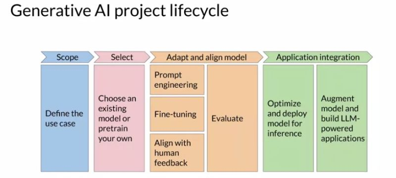
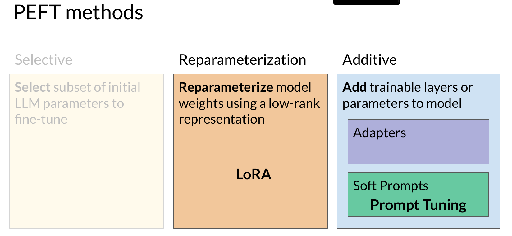

# llm-finetuning
Apply some techiques for fine-tuning Generative AI with Large Language Models

## 1. Generative AI & LLMs
Generative AI, or Generative Artificial Intelligence, refers to the field of AI that focuses on creating models capable of generating new content, such as text, images, or even music. These models are trained on large datasets and learn to mimic or approximate human abilities in content creation.

Large Language Models (LLMs) are a specific type of generative AI model that specialize in natural language generation. These models have been trained on massive amounts of text data, often trillions of words, and have billions of parameters, which can be thought of as their memory or capacity to understand and generate language.

LLMs have the ability to understand and respond to natural language instructions, known as prompts, and can generate text that is coherent and contextually relevant. They can be used for various tasks, such as answering questions, generating creative writing, or even assisting in code development.

The limitations of previous generative algorithms, specifically recurrent neural networks (RNNs). RNNs require a significant amount of compute and memory to perform well at generative tasks. The video provides an example of an RNN attempting a next-word prediction task and shows that even with scaling the model, it still struggles to make accurate predictions. The video highlights the complexity of language, including homonyms and syntactic ambiguity, which make it challenging for algorithms to understand human language. However, in 2017, the transformer architecture was introduced, which revolutionized generative AI. The transformer architecture can be efficiently scaled using multi-core GPUs and can parallel process input data, leading to significant progress in generative AI.

Some important terminology related to generative AI with large language models. Here are the key points:
- The text that you input into the model is called the prompt.
- The act of generating text is known as inference.
- The output text is called the completion.
- The full amount of text available for the prompt is called the context window.
- Prompt engineering is the process of revising the language in your prompt to get the desired outcome.
- In-context learning involves including examples or additional data within the prompt to help the model understand the task better.
- Zero-shot inference is when you include input data within the prompt to guide the model's response.
- Larger models are generally better at zero-shot inference, while smaller models may struggle.
- One-shot inference involves providing a completed example within the prompt to improve performance.
- Few-shot inference includes multiple examples within the prompt to help the model understand the task.
- The context window has a limit, so if including multiple examples doesn't work, you may need to try fine-tuning the model.
- Fine-tuning involves additional training on the model using new data to improve its performance.
- The ability of models to perform multiple tasks depends on their scale, with larger models being more versatile.
- Smaller models are generally only good at tasks similar to what they were trained on.
- It may take some experimentation to find the right model for your specific use case.

Some parameters that can influence the behavior of large language models (LLMs) during next-word generation. These parameters are different from the training parameters and are used during inference. Some of the methods discussed include:

- Max new tokens: This parameter limits the number of tokens the model will generate.
- Greedy decoding: The model chooses the word with the highest probability, which can lead to repeated words or sequences.
- Random sampling: Instead of always selecting the most probable word, the model chooses an output word at random based on the probability distribution. This reduces the likelihood of repeated words but can result in less coherent output.
- Top k sampling: The model chooses from the k tokens with the highest probability, introducing randomness while preventing highly improbable words.
- Top p sampling: The model limits random sampling to predictions whose combined probabilities do not exceed a certain threshold.
- Temperature: This parameter influences the randomness of the model's output. Higher values increase randomness, while lower values make the output more focused on likely word sequences.

The generative AI project life cycle:

- Defining the scope: It is important to accurately and narrowly define the tasks you want your LLM to perform in your specific application. This will help save time and compute cost.
- Choosing a model: You can either train your own model from scratch or work with an existing base model. Starting with an existing model is generally recommended, but there are cases where training from scratch may be necessary.
- Assessing performance and additional training: After obtaining a model, you need to evaluate its performance and carry out additional training if needed. Prompt engineering and fine-tuning techniques can be used to improve the model's performance.
- Ensuring model behavior: As models become more capable, it is important to ensure that they behave well and align with human preferences. Reinforcement learning with human feedback is a technique that can help achieve this.
- Evaluation: Metrics and benchmarks are used to determine how well the model is performing and aligned with preferences.
- Deployment and optimization: Once you have a model that meets your performance needs and is well aligned, you can deploy it and optimize it for deployment. This includes making the best use of compute resources and providing a good user experience.
- Overcoming limitations: LLMs have limitations, such as inventing information when they don't know an answer or limited ability in complex reasoning and mathematics. The course will cover techniques to overcome these limitations.

## 2. Fine-tuning LLMs
### 2.1 Fine-tuning LLMs with instruction
Fine-tuning is a supervised learning process where you use a dataset of labeled examples to update the weights of the language model. It extends the training of the model to improve its ability to generate good completions for a specific task.

- Instruction fine-tuning: This strategy trains the model using examples that demonstrate how it should respond to a specific instruction. For example, if you want to improve the model's summarization ability, you would provide examples that begin with the instruction "summarize."
- Full fine-tuning: In full fine-tuning, all of the model's weights are updated, resulting in a new version of the model with updated weights. However, it requires enough memory and compute budget to store and process all the gradients and optimizers.
- Preparing training data: Prompt template libraries can be used to convert existing datasets into instruction prompt datasets for fine-tuning. These libraries include templates for different tasks and datasets.
- Training and evaluation: The training data set is divided into training, validation, and test splits. During fine-tuning, prompts are passed to the language model, and the generated completions are compared with the expected responses in the training data. The model's weights are updated using backpropagation and cross-entropy loss. Evaluation is done using the validation and test data sets to measure the model's performance.
- Result: The fine-tuning process results in a new version of the base model, called an instruct model, that is better at the specific tasks you are interested in.

#### Fine-tuning pre-trained language models for specific tasks
- Fine-tuning allows us to improve the performance of a pre-trained model on a specific task of interest.
- Even with a relatively small dataset of 500-1,000 examples, we can achieve good results.
- However, fine-tuning on a single task may lead to catastrophic forgetting, where the model forgets how to perform other tasks.
- To avoid catastrophic forgetting, we have two options:
  - If we only need reliable performance on the fine-tuned task, it may not be an issue.
  - If we want the model to maintain its multitask capabilities, we can perform multitask fine-tuning with 50-100,000 examples across multiple tasks.
- Another option is parameter efficient fine-tuning (PEFT), which preserves most of the pre-trained weights and trains only a small number of task-specific adapter layers and parameters.
- PEFT shows greater robustness to catastrophic forgetting.

### 2.2 Parameter efficient fine-tuning (PEFT)
Training LLMs is computationally intensive and requires a lot of memory.
Full fine-tuning updates every model weight during supervised learning, which can be challenging to handle on consumer hardware.

- PEFT methods only update a small subset of parameters, making the memory requirements more manageable.
- PEFT can often be performed on a single GPU.
- PEFT is less prone to catastrophic forgetting problems compared to full fine-tuning.
- With PEFT, the number of trained parameters is much smaller than the original LLM, typically around 15-20%.
- PEFT allows efficient adaptation of the original model to multiple tasks.
- There are three main classes of PEFT methods: selective methods, reparameterization methods, and additive methods.
    - Selective methods fine-tune only a subset of the original LLM parameters.
    - Reparameterization methods reduce the number of parameters by creating low rank transformations of the original network weights.
    - Additive methods keep the original LLM weights frozen and introduce new trainable components. Adapter methods add new trainable layers to the model architecture, while soft prompt methods focus on manipulating the input to achieve better performance.
  

#### Low-rank Adaptation (LoRA)
Low-rank Adaptation (LoRA), which is a parameter-efficient fine-tuning technique for large language models. Here's a summary of the key points covered:
- LoRA is a strategy that reduces the number of parameters to be trained during fine-tuning by freezing the original model parameters and injecting a pair of rank decomposition matrices alongside the original weights.
- The smaller rank decomposition matrices are trained using the same supervised learning process as the original model.
- During inference, the low-rank matrices are multiplied together and added to the original weights to create a LoRA fine-tuned model.
- Applying LoRA to just the self-attention layers of the model is often enough to achieve performance gains, as most of the parameters in large language models are in these layers.
- By using LoRA, you can significantly reduce the number of trainable parameters, allowing you to fine-tune with a single GPU and avoid the need for a distributed cluster of GPUs.
- LoRA matrices can be fine-tuned for different tasks and switched out at inference time by updating the weights, without the need to store multiple full-size versions of the language model.
- The choice of rank for the LoRA matrices is an active area of research, with ranks in the range of 4-32 providing a good trade-off between reducing trainable parameters and preserving performance.

Overall, LoRA is a powerful fine-tuning method that achieves great performance while reducing the computational requirements of training large language models.

#### Soft prompts
Prompt tuning involves adding additional trainable tokens to your prompt and allowing the supervised learning process to determine their optimal values. These trainable tokens, called soft prompts, are prepended to the embedding vectors that represent your input text. Prompt tuning is a more efficient strategy compared to full fine-tuning because only a few parameters are being trained. You can train different sets of soft prompts for different tasks and easily swap them out at inference time. The performance of prompt tuning improves as the model size increases, and it can be as effective as full fine-tuning for models with around 10 billion parameters. One potential issue with prompt tuning is the interpretability of the learned virtual tokens, as they don't correspond to any known token in the vocabulary. However, an analysis shows that the nearest neighbor tokens to the soft prompt location form tight semantic clusters, suggesting that the prompts are learning word-like representations. Prompt tuning, along with another method called LoRA, allows you to fine-tune models with improved performance while using less compute than full fine-tuning methods.

## 3. Reinforcement learning from human feedback
Fine-tuning helps improve the performance of models by training them to better understand human-like prompts and generate more natural-sounding language. However, large language models trained on vast amounts of internet data can sometimes behave badly. Examples include using toxic language, providing misleading or incorrect answers, and creating harmful completions. To address these issues, developers follow a set of principles called HHH (helpfulness, honesty, and harmlessness) to guide the responsible use of AI. Additional fine-tuning with human feedback can align models with human preferences and increase the helpfulness, honesty, and harmlessness of their completions.

Reinforcement learning from human feedback (RLHF) is a popular technique to fine-tune large language models. RLHF helps align the model with human preferences, maximize usefulness and relevance, and minimize potential harm.
